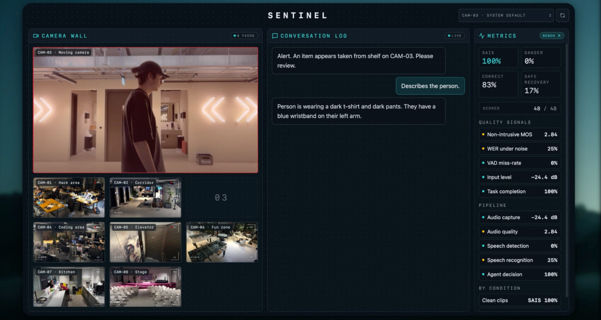

<div align="center">

# Sentinel

### A voice-first retail security copilot that hears the guard, watches the cameras, and *never* takes an unsafe action under noise.




</div>

---

## Why Sentinel exists

Retail security guards have their hands full and the store is loud — fridges humming, beeps, kids, intercoms. Standard voice assistants degrade *silently* in this environment: they still return *a* transcript, just the wrong one. In security, a wrong action is dangerous.

Sentinel is a voice walkie-talkie between the guard's phone and the camera wall. When a camera spots something worth reviewing, Sentinel speaks the alert into the guard's earpiece. The guard answers by voice. Under noise, **ai-coustics** cleans the audio before STT, and Sentinel's safety policy converts uncertainty into *clarification*, not into a wrong action.

> One-liner: **Hands-free, works in noise, and never does the wrong thing.**

## Tech stack

| Layer | Tech |
|---|---|
| Voice transport | [LiveKit Cloud](https://livekit.io) (audio + data channels) |
| Voice agent runtime | [`livekit-agents`](https://github.com/livekit/agents) 1.5 (Python) |
| Speech enhancement | [ai-coustics QUAIL_L](https://www.ai-coustics.com/) (server-side via LiveKit Cloud) |
| STT + TTS | [Gradium](https://gradium.ai) (`livekit-plugins-gradium`) |
| LLM | [Gemini 2.5 Flash Lite](https://ai.google.dev/gemini-api) (replies + CAM-03 visual analysis) |
| Frontend | Vite, React 19, TypeScript, Tailwind, [TanStack Start](https://tanstack.com/start) (SSR) |
| Runtime | [Bun](https://bun.sh) (UI), [uv](https://github.com/astral-sh/uv)/`venv` (voice agent) |
| Deploy target | Cloudflare Workers |

## Architecture

```
        ┌──────────────────────┐                ┌──────────────────────┐
        │  Phone /voice        │  guard mic     │  LiveKit Cloud       │
        │  (push-to-talk)      ├───────────────►│  + ai-coustics       │
        └──────────────────────┘                │   QUAIL_L (server)   │
                  ▲    plays TTS                └──────────┬───────────┘
                  │                                        ▼
        ┌──────────────────────┐                ┌──────────────────────┐
        │  Laptop dashboard /  │  visual-alert  │  Python voice agent  │
        │  CAM-03 + chat log   ├───────────────►│  Gradium STT/TTS     │
        │  (Gemini analyzes    │◄───────────────┤  Gemini reply        │
        │   CAM-03 frames)     │   sentinel.    │  Safety routing      │
        └──────────────────────┘   voice data   └──────────────────────┘
```

- Dashboard at `/` joins LiveKit as `sentinel-dashboard` (data only).
- Phone at `/voice` joins as `sentinel-guard-mic` (push-to-talk).
- Voice agent self-dispatches into room `sentinel-live` and re-arms after every disconnect.
- Metrics page at `/metrics` shows our **SAIS** (Sentinel Audio Intelligence Score) benchmark.

## What's our metric?

**SAIS = 0.5 · Command Fidelity + 0.3 · Time-to-Correct-Action + 0.2 · Safe Recovery Rate.**

Headline result on the bundled corpus (16 cases × 3 system tracks = 48 evaluations):

| System | SAIS | Dangerous error rate |
|---|---|---|
| Raw noisy audio | **58%** | 25% |
| + ai-coustics | **76%** | 12.5% |
| **+ ai-coustics + Sentinel** | **86%** | **0%** |

The first jump is what ai-coustics buys. The second is what Sentinel's safe-recovery routing buys on top. See [`docs/sentinel-audio-intelligence-metric.md`](docs/sentinel-audio-intelligence-metric.md) for the full definition and the honesty disclosure on the NISQA-like estimator we ship in `apps/voice/src/nisqa.py`.

## Quick start

### 0. Get keys

Copy `.env.example` to `.env` and fill in:

```
LIVEKIT_URL=wss://your-project.livekit.cloud
LIVEKIT_API_KEY=APIxxxxxxxx
LIVEKIT_API_SECRET=...
GEMINI_API_KEY=AIza...
GRADIUM_API_KEY=gsk_...
```

The ai-coustics integration is configured in your LiveKit Cloud project (LiveKit Cloud forwards a short-lived credential to the plugin); no client SDK key is shipped to the browser.

### 1. UI (laptop dashboard + phone walkie-talkie)

```bash
cd ui
bun install
bun run dev
```

The dev server runs on **HTTPS** with a self-signed cert (required so phones on the LAN can use `getUserMedia`). Vite prints a localhost URL (laptop dashboard) and a LAN URL (phone `/voice` page). Phones need to accept the self-signed cert warning once.

### 2. Voice agent

```bash
cd apps/voice
python -m venv .venv
source .venv/bin/activate    # macOS/Linux
pip install -r requirements.txt
python -m src.agent dev
```

Wait for `self-dispatched agent into room=sentinel-live` in the log.

### 3. Use it

1. On the laptop, open `https://localhost:<port>/`. Allow camera access; CAM-03 is your live laptop webcam.
2. On the phone, open `https://<lan-ip>:<port>/voice`. Tap **"tap to hear sentinel"** to unlock audio (iOS/Safari requirement).
3. Hold an object up to CAM-03 → Sentinel speaks an alert into the phone.
4. Hold the mic button on the phone and respond — the agent processes through ai-coustics → Gradium STT → Gemini → Gradium TTS → back to your phone speaker.
5. Open `/metrics` on the laptop to see the SAIS dashboard.

## Repo layout

```
ui/                            # dashboard + /voice + /metrics (Vite + TanStack)
  src/routes/index.tsx         # dashboard
  src/routes/voice.tsx         # phone walkie-talkie
  src/routes/metrics.tsx       # SAIS dashboard
  src/lib/use-sentinel-room.ts # single LiveKit hook for both modes
  src/lib/audio-bench.ts       # in-browser ai-coustics live bench

apps/voice/                    # Python LiveKit agent
  src/agent.py                 # entrypoint, dispatch lifecycle, Gemini reply
  src/interpret.py             # command classifier
  src/nisqa.py                 # NISQA-like MOS estimator (heuristic)
  src/evaluate_audio_intelligence.py  # SAIS benchmark
  fixtures/audio_intelligence_scenarios.json
  dataset/                     # 48 real WAV clips (16 commands, clean/noisy)

docs/
  agent-context.md                          # canonical product+architecture context
  demo-plan.md                               # demo flow
  sentinel-audio-intelligence-metric.md      # SAIS definition + judge disclosures
  assets/dashboard.jpg                       # screenshot above

.env                           # repo-root, loaded by both UI and agent
CLAUDE.md                      # operational rules for AI coding assistants
```

## Safety stance

Sentinel is a **human-review tool**. It surfaces review-worthy events and helps the guard act on them by voice. It does not accuse, identify, or enforce. No facial recognition, no identity tracking, no automated detentions. When uncertain, the agent asks for clarification instead of taking action — that's the load-bearing safety property and it's measured directly in SAIS.

## Built at

Berlin · April 2026 · ai-coustics × LiveKit hackathon track.

## License

MIT.
